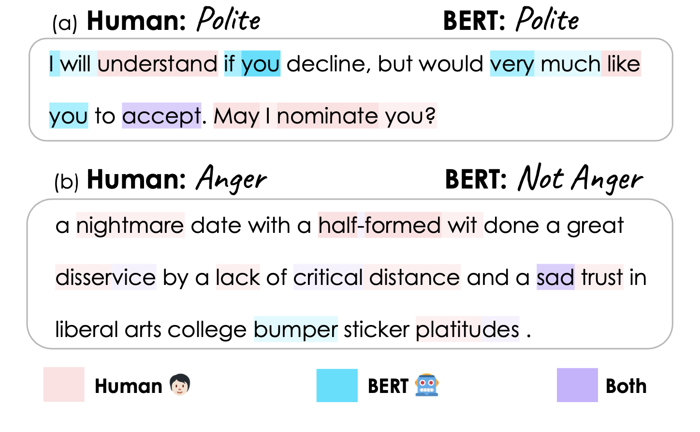

# Hummingbird
Hummingbird dataset and code for EMNLP 2021 paper "Does BERT Learn as Humans Perceive? Understanding Linguistic Styles through Lexica"




## Hummingbird Dataset
Dataset is under ``data/hummingbird`` folder. It contains annotated texts for all the eight styles (politeness, sentiment, anger, disgust, fear, joy, and sadness).

Below is the explanation of each column
* ``human_label``	= annotator's style label for the text
  * 0 if the text is polite, positive, anger, disgust, fear, joy, or sad, 
  * 1 if the text is impolite, negative, not anger, etc, 
  * 0.5 if neutral for "politeness" and "sentiment"
* ``orig_text``	= original text
* ``processed_text`` = text after preprocessing (lower case and removal of some punctuations)
* ``perception_scores``	= human's perception label for the tokens in processed_text

## A Subset of Existing Datasets
A subset of benchmarking dataset is under `data/orig` folder. It has word importance scores from Captum. 
* ``pred_class`` = predicted label, 
  * 0 if the text is polite, positive, anger, disgust, fear, joy, or sad, 
  * 1 if the text is impolite, negative, not anger, etc.,
* ``pred_prob``	= prediction probability
* ``raw_input``	= tokenized text by BERT
* ``attribution_scores`` = word importance scores by integrated gradients from Captum

These existing datasets are extracted from the following previous works:
| Style | Name | Link |
| :---: | :---: | :---: |
| Politeness | Stanford Politeness | [link](https://www.cs.cornell.edu/~cristian/Politeness.html) |
| Sentiment  |  Sentiment Treebank | [link](https://nlp.stanford.edu/sentiment/treebank.html) |
| Offensiveness |  Tweet Datasets for Hate Speech and Offensiveness | [link](https://github.com/t-davidson/hate-speech-and-offensive-language) |
|  Emotion |  SemEval 2018| [link](https://competitions.codalab.org/competitions/17751#learn_the_details-datasets) |

## Code
All of our codes for processing the dataset will be available here. 

## BibTex
```
# coding=utf-8

@InProceedings{hayati-etal-2021hummingbird,
  author = 	"Hayati, Shirley Anugrah
		and Kang, Dongyeop
		and Ungar, Lyle",
  title = 	"Does BERT Learn as Humans Perceive? Understanding Linguistic Styles through Lexica",
  booktitle = 	"Proceedings of the 2021 Conference on Empirical Methods in Natural Language Processing",
  year = 	"2021",
  publisher = 	"Association for Computational Linguistics",
  location = 	"Punta Cana, Dominican Republic",
  url = 	"https://arxiv.org/pdf/2109.02738.pdf"
}
```

